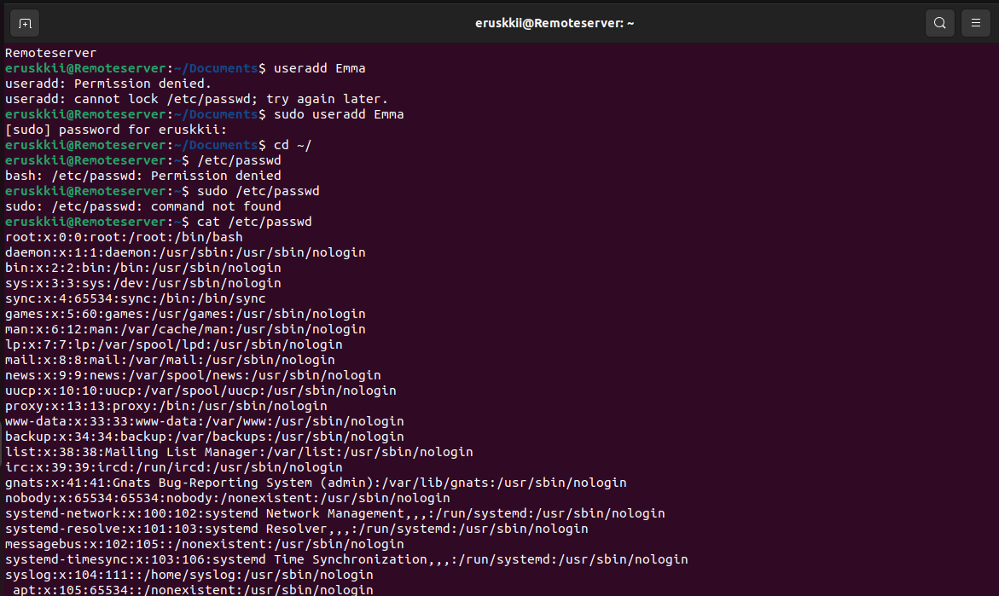

# Linux Commands practice

## Step 1

Install updates on Linux

`sudo apt upgrade`

Running this command brought an error that my user did not have the permission

## Step 2 
So I ran the command to add the user to root or administrator group

`sudo usermod -aG sudo myusername`

## Step 3 

Run sudo command again and it was sucussful

## Stage 4

Tested the `PwD`, `cd` and `ls` commands. 

## Stage 5

To use the `cat` command, I first created a file using the `touch` command. 

Then used cat to display the content of the files separately and combined.

## Stage 6

Tested the `cp` command to copy files from one directory to another, and copy the content of one file to another file. 

The `cd` `ls` and `cat` command help us display the files and folders as needed.

## Stage 7 

Used the `mv` command to move and rename folders and find. 

Once again `cd` and `ls` help us to navigate and validate that the action has taken place

## Stage 8

Used `rmdir` and `rm` to delete empty directories and files respectively

Once again `cd` and `ls` help us to navigate and validate that the action has taken place

## Stage 9

Used `touch` command to create html file 

Validated with `cd` and `ls`

## Stage 10

Tried to use the locate command but I got the error that my package didn't have it

I ran the `command sudo apt install plocate` to enable it in my package

## Stage 11

Ran the `locate`, `find` and `grep` commands in quick succession

## Stage 12

Ran the `df`, `du`, `head`, and `tail` command to report directory storage usage, file size, first line of file, and last line of a file

## Stage 13

Created a tar file use the `tar` company and specified with the option -`cvf` to create the file (c) list the files as it archives them (v or verbose), and specifies the name as newarchive.tar (f)

## Stage 14

Tested the `ping` command. After an infinite first try, I used the `-c` option to specify the number of pings

## Stage 15

Used the `zip` command to archive file 

## Stage 16

Added user "Emma" with the useradd comnmand. validated with the `cat` on the `/etc/passwd` file and the `gentent passwd` command

## Stage 17

Tested the `Ps` command and Installed Htop with the `sudo snap install htop` command

## Stage 18

Tested the Htop command

