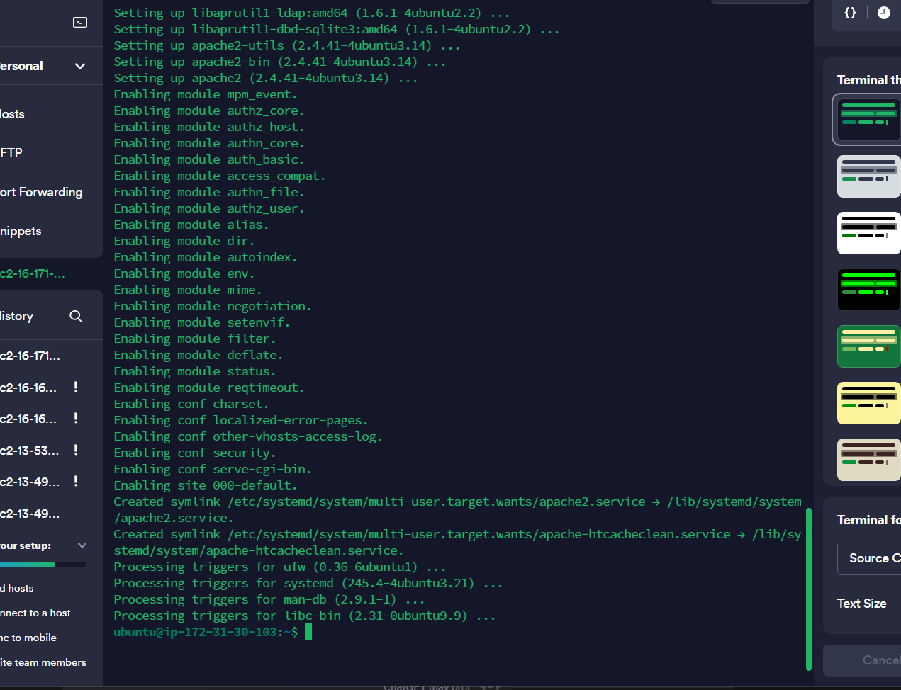

This is the start of Lamp stack project

## Step 0

Already have and AWS account, so I started the EC2 instance I created during the introductory class. 

Clicked on "Connect instance" and copied the ssh command that contains the public dns address and the downloaded key

Succesfully connected to the instance on the Termius terminal. Decided to use termius so I can work on the project on my PC at home or on my tablet on the go.

## Step 1 - Install Apache

I updated the list of packages in package manager with the `sudo apt update` command

I then ran apache2 package installation
with `sudo apt install apache2`

It was successful

Set the inbound rules for my security group to All traffic. This allowed me to connect to my ssh client and should also open up all ports

Use the command `curl localhost`to test the server on my terminal

Use my <public ip address> on AWS terminal to open the Apache web page

## Step 2 Install Mysql

Used the `sudo apt install mysql-server` to initiate mysql installation. hit `y` when prompted

I logged in to mySQL with `sudo mysql`

As instruced I used the `ALTER USER 'root'@'localhost' IDENTIFIED WITH mysql_native_password BY 'PassWord.1';` to set a password. Then I hit `exit`

Started the secure instllation script with the `sudo mysql_secure_installation`command.

Following the prompt, I changed the suggested password to one of my choice with MEDIUM level strength of `1`. Estimated password strength was `100` 

I kept sending `y` to prompts where it removed anonymous users and test database, disabled remote logins and loaded new rules. 

Logged in with the `sudo mysql -p` command. The `-p` was used to initiate a password prompt and it was successful.

## Step 3 - Install PHP

I installed the core PHP dependencies, the PHP mysql module and the apache module in one fell swoop with the `$ sudo apt install php libapache2-mod-php php-mysql` command
'

confirmed version with `php -v`

## Step 4 - Set up virtual host

I set up a domain named `projectlamp`. We'll create a directory using the command `sudo mkdir /var/www/projectlamp`

I changed ownership of the directory to current user using
 `sudo chown -R $USER:$USER /var/www/projectlamp`

 create a new cofiguration file in Apache's sites-available folder using the `vi`command and the following command in full

 `sudo vi /etc/apache2/sites-available/projectlamp.conf`

 Used `i` to enter insert mode and pasted the code `` as instructed. 

 Used `ls` to display the files in the sites-available directory

used the `sudo a2ensite projectlamp` to enable virtual host. Asked me to reload Apache which I did using `sudo systemctl reload apache2`

 Disable Apache's default website using `$ sudo a2dissite 000-default`

Test config file to make sure there are no errors with the  `sudo apache2ctl configtest`command

Reloaded Apache for changes to take effect `$ sudo systemctl reload apache2`

Created an html file in the custom web root with `sudo echo 'Hello LAMP from hostname' $(curl -s http://169.254.169.254/latest/meta-data/public-hostname) 'with public IP' $(curl -s http://169.254.169.254/latest/meta-data/public-ipv4) > /var/www/projectlamp/index.html`

Tested it on browser using my public Ip and public DNS

IP on browser

DNS on browser

## Step 5 - Enable Php
Used the
`sudo vim /etc/apache2/mods-enabled/dir.conf`to change default file order of `index.html and index.php`

I had to figure out that I need to press `i` to enter --insert-- mode so I can edit and delete text and `v` to enter visual mode to let me copy, cut, and paste. 

Reloaded Apache for changes to take effect
using 

`sudo systemctl reload apache2`

Created a new file named `index.php` inside the custom web root folder `projectlamp`

`vim /var/www/projectlamp/index.php`

Pasted PHP code in insert mode after hitting `i`

Refreshed the PHP page on the browser

In this project, I learnt how to install Apache, Mysql, and PHP. Understood how they worked together better when I replaced the default Apache web page with the PHP webpage. All in all, a fruitful experience. 

